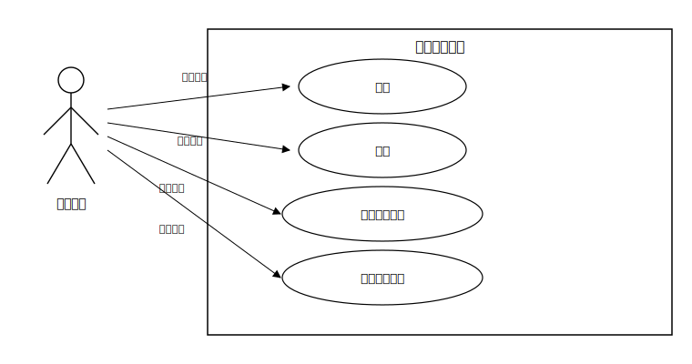
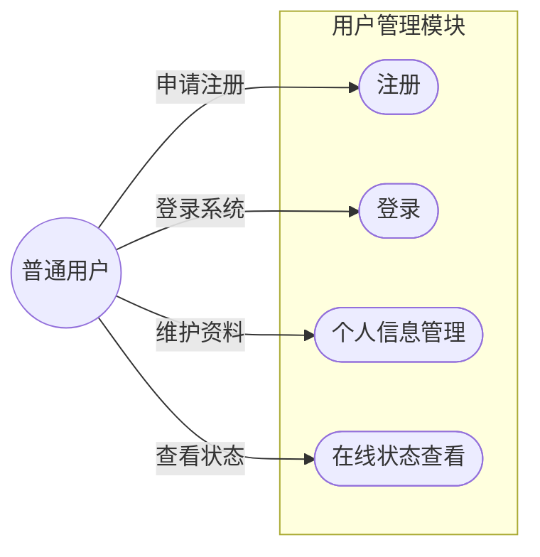
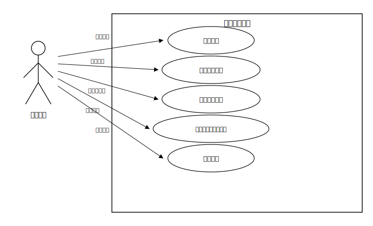
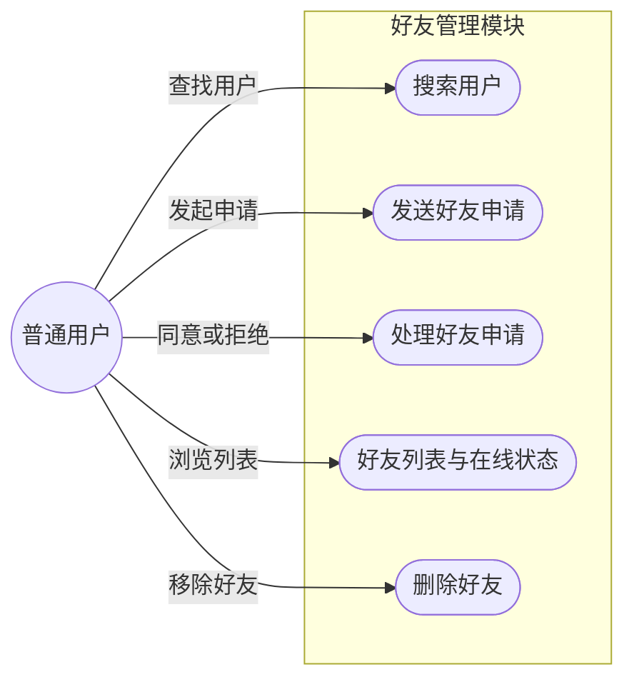
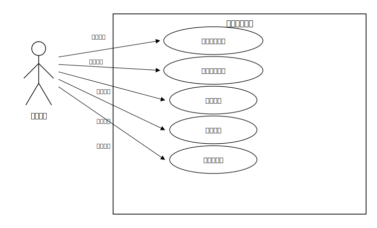
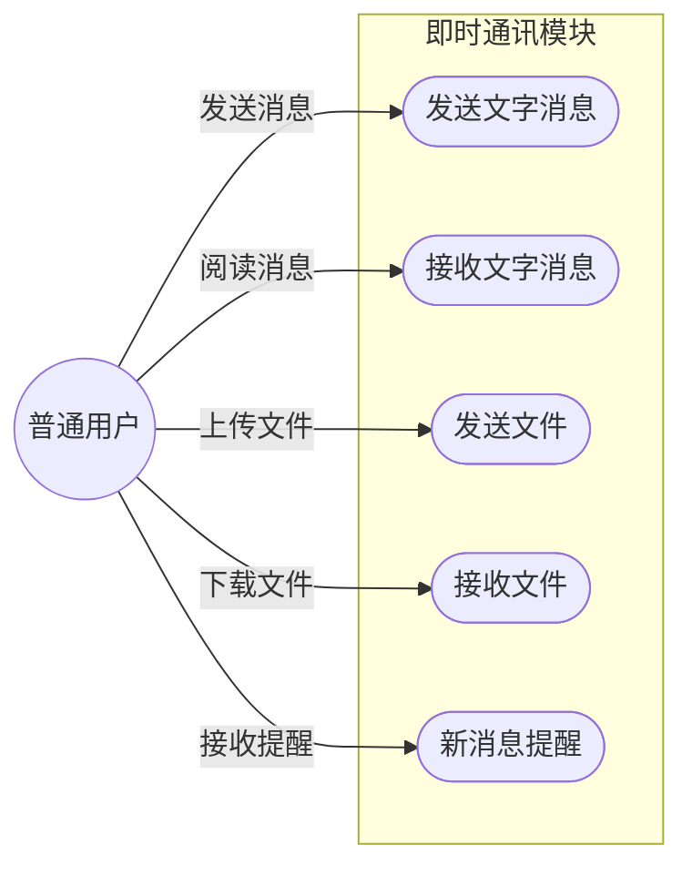
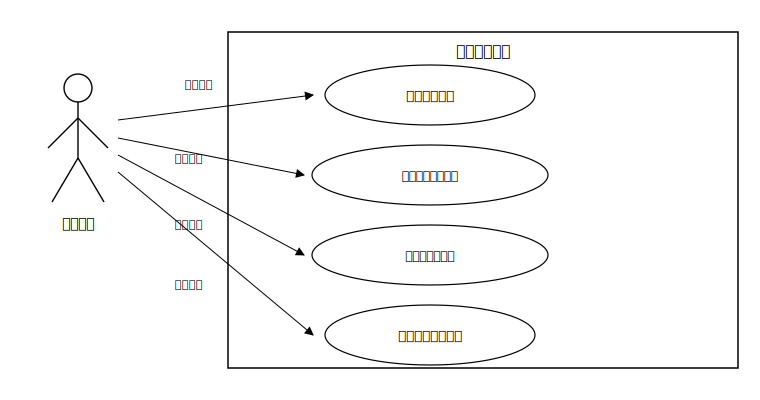
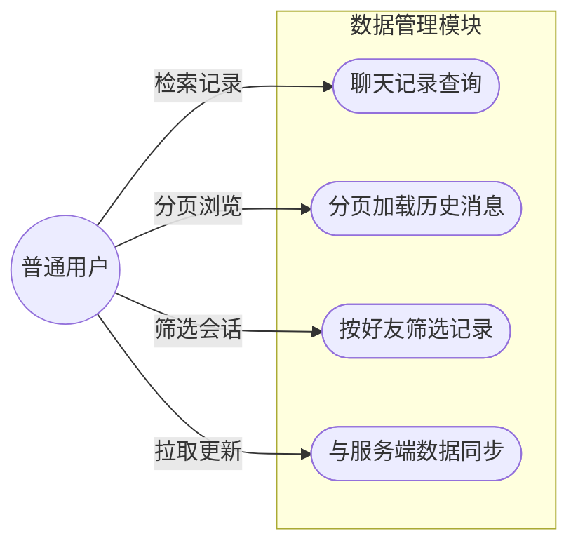

# 第3章 系统需求分析

## 3.1 可行性分析

在局域网聊天系统开发前，需从技术、经济与操作等维度评估可行性，以降低实施风险。

1. **经济可行性**：系统核心采用 **C++**、**Qt 6**（开源版本）与 **SQLite**，不依赖商业数据库与公网托管资源；部署复用现有局域网环境，无需额外购置公网服务器与大带宽。若引入邮箱发信的**独立辅助服务**，亦可选用开源运行时与免费/低成本邮箱服务（按服务商规则配置 **SMTP** 与授权方式），整体建设与运维成本可控。

2. **技术可行性**：**客户端**采用 **C++** 与 **Qt 6**，可较高效地完成跨平台界面与网络交互（如基于 `QTcpSocket` 的长连接）；**服务端**采用标准 **C++** 与 **TCP/IP Socket**、多线程等机制实现接入、路由与持久化，可在 **Windows、Linux** 下分别编译部署，技术路线成熟。**SQLite** 以单文件形式嵌入服务端进程，满足用户、关系与消息等结构化存储需求；验证码邮件通过 **SMTP** 发送时，由辅助服务承担投递、主服务端负责业务校验，可降低主程序在邮件协议实现上的复杂度。

3. **操作可行性**：界面布局遵循常见即时通讯习惯（如好友列表与聊天区域分区），降低学习成本；邮箱验证码注册/登录符合主流互联网产品使用习惯。局域网内通过配置服务器地址与端口即可接入，适合实验室、办公室等场景的快速试用与部署。

## 3.2 功能需求分析

本系统功能需求覆盖从用户接入、关系维护到消息与文件交互的完整闭环。按模块划分如下。

各小节附有**用例图**：**SVG** 文件（`毕业设计/figures/` 下）适合插入 Word；若本地浏览器打开 SVG 异常，多为路径含中文或编码问题——当前 SVG 已采用 **Unicode 字符引用（`&#xXXXX;`）** 书写中文，文件本身为 **UTF-8 纯 ASCII 可解析内容**。同时在各图后给出 **Mermaid** 源码，便于在支持 Mermaid 的 Markdown 预览中直接查看。

### 3.2.1 用户管理模块

* **注册**：用户提交邮箱并获取验证码，校验通过后完成注册，保证账号与邮箱的绑定关系可追溯。
* **登录**：支持账号（或邮箱）与密码登录；可提供“记住密码”“自动登录”等便捷选项（需在安全与易用之间权衡实现细节）。
* **个人信息**：支持修改昵称、头像、个性签名等；在线状态由会话维持情况与心跳等机制驱动展示。

下图所示为用户管理模块的用例图，展示了普通用户在注册登录、资料维护与状态查看等环节涉及的主要交互行为。

**图 3-1 用户管理模块用例图**

### 3.2.2 好友管理模块

* **查找与添加**：支持按账号或邮箱等标识检索用户并发起好友申请。
* **申请处理**：用户可查看待处理申请并同意或拒绝。
* **列表与状态**：好友列表展示在线/离线等状态；支持删除好友等关系维护操作。

下图所示为好友管理模块的用例图，展示了普通用户在查找用户、发起与处理申请、浏览列表及维护关系时的主要交互行为。

**图 3-2 好友管理模块用例图**

### 3.2.3 即时通讯模块

* **文字消息**：点对点即时收发，支持常用表情与发送状态提示（如发送中/已送达等，具体粒度以实现为准）。
* **文件传输**：支持大文件传输；采用分片与进度反馈等策略，在局域网带宽条件下保证传输过程可观测、可恢复（策略细节在设计与实现章节给出）。
* **提醒**：新消息到达时可结合任务栏图标、提示音等方式提醒用户。

下图所示为即时通讯模块的用例图，展示了普通用户在文字与文件收发及消息提醒方面的主要交互行为。

**图 3-3 即时通讯模块用例图**

### 3.2.4 数据管理模块

* **持久化**：**服务端**以 **SQLite** 为主存储用户、好友关系、消息记录及与传输相关的元数据，保证多终端登录与历史追溯的一致性来源。
* **查询与展示**：客户端按好友、时间等维度分页拉取并展示历史记录；若实现本地缓存，用于提升加载体验，应以服务端数据为准进行同步或校验。

下图所示为数据管理模块的用例图，展示了普通用户在聊天记录检索、分页浏览、按好友筛选及从服务端拉取更新时的主要交互行为（持久化由服务端在后台完成，对使用者表现为可靠可查的历史数据）。

**图 3-4 数据管理模块用例图**

## 3.3 非功能性需求分析

除功能范围外，系统应满足下列非功能性要求。

1. **性能与实时性**：局域网链路延迟通常较低；文字消息端到端交互应在用户可感知范围内保持实时（在理想网络条件下，可将“百毫秒量级”作为设计与测试的参考目标之一）。界面切换与列表滚动应保持流畅，避免长时间阻塞主线程。

2. **并发与可用性**：服务端应具备同时维护多路客户端连接的能力（例如不少于数十路并发接入的实验室测试场景）；在多用户同时进行消息与文件传输时，系统应保持稳定，不因单点异常导致整体崩溃（具体容量与瓶颈可在测试中量化）。

3. **跨平台与可移植性**：服务端应能在 **Windows** 与 **Linux** 环境下完成构建与运行验证；客户端在既定目标平台上提供一致的核心功能与相近的交互体验。

4. **安全性**：验证码发送走 **SMTP** 通道，并对发送频率、有效期与错误次数等进行约束，降低恶意注册与撞库风险；用户口令等敏感字段在入库前应进行哈希（加盐）等处理，降低数据库文件泄露后的风险。辅助发信服务与主服务端之间的调用宜限制在可信网络内并配合密钥或令牌校验，避免被未授权调用。

5. **可维护性**：**C/S** 职责边界清晰，通信协议与错误码定义规范，便于联调、排错与后续扩展（如增加消息类型或管理功能）。
