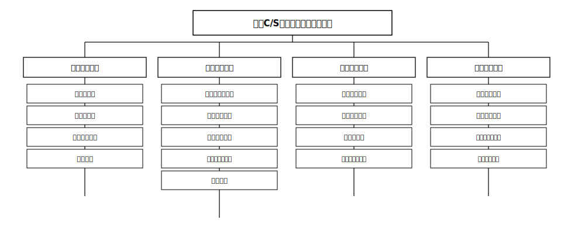
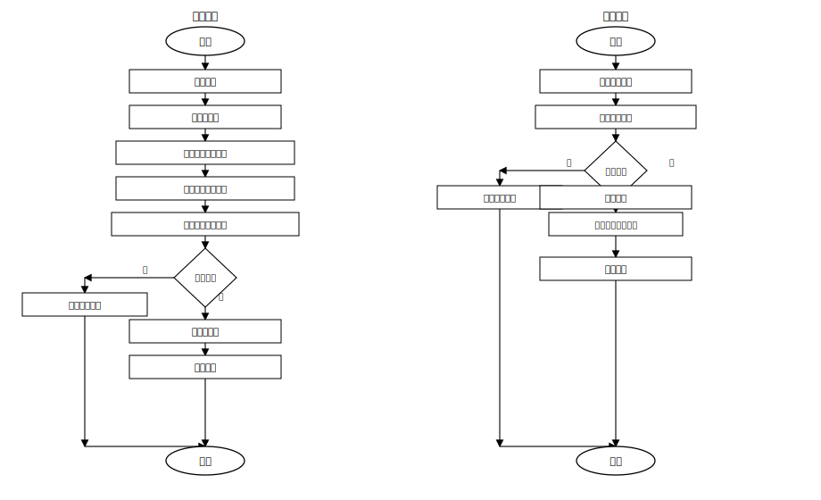
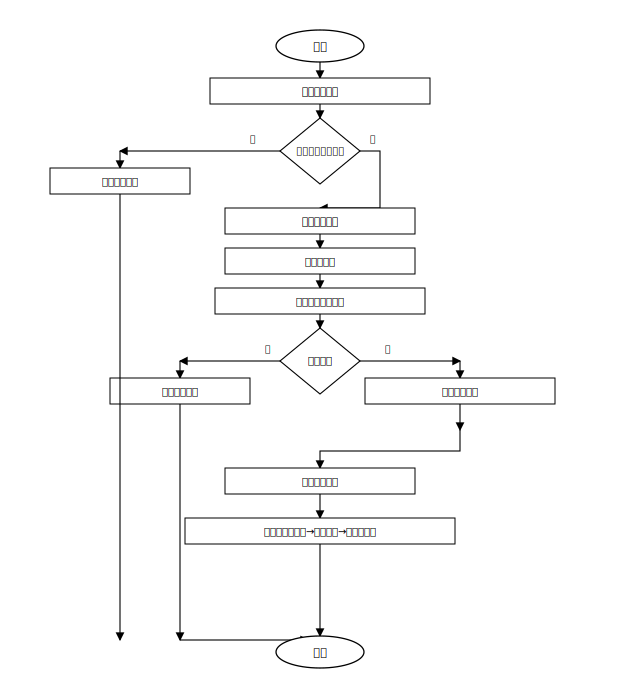
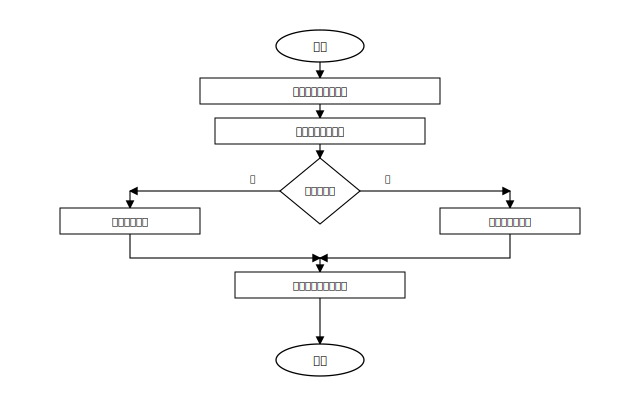
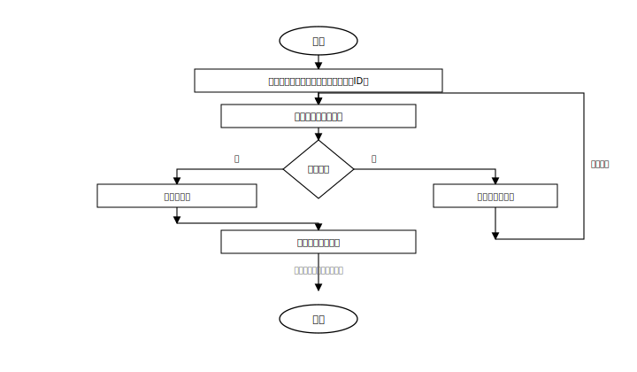
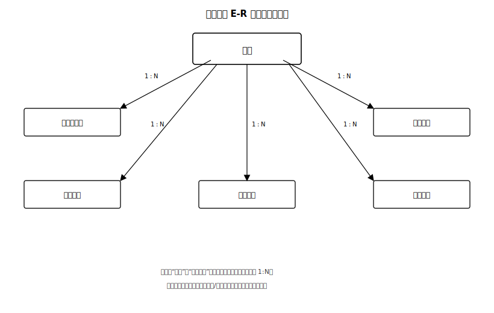
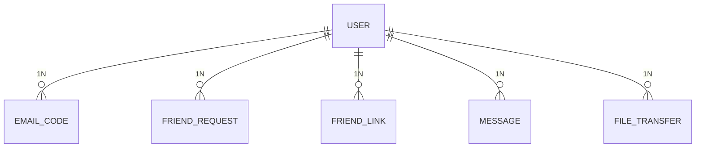

# 第4章 系统设计

## 4.1 系统总体架构设计

本系统采用典型的 **C/S（Client/Server）模式**，通过职责分离提升稳定性与可维护性。整体由 **聊天服务端**、**Qt 客户端** 以及可选的 **邮件辅助服务** 组成。

1. **客户端架构（分层）**：客户端采用分层结构，包括 **UI 表现层**、**业务逻辑层** 与 **网络通信层**。**UI 表现层**基于 **Qt 6** 实现界面渲染与交互；**业务逻辑层**处理注册登录、好友与消息等业务规则，并向网络层下发请求；**网络通信层**通过 `QTcpSocket` 与聊天服务端维持 **TCP** 长连接，负责应用层数据包的封装、发送、接收与粘包/半包处理。

2. **服务端架构（模块）**：聊天服务端由 **C++** 实现，可在 **Windows / Linux** 部署，核心模块包括：**接入与连接管理**（监听端口、接受连接、会话与心跳维护）、**协议处理与路由**（解析报文、鉴权、按目标用户转发即时消息/信令）、**数据访问层**（与 **SQLite** 交互，完成用户、关系与消息的持久化）。并发策略可采用每连接一线程、线程池或 **I/O 多路复用** 等方案，在实现章节结合选型说明。

3. **邮件辅助服务（可选组件）**：**邮箱验证码**的 **SMTP** 投递由体量较小的 **独立辅助服务** 完成（如基于 Node.js 等运行时）；**聊天主服务端**负责验证码生成、有效期、次数限制与校验结果落库，二者之间通过 **内网 HTTP** 等轻量接口协作，并对调用方做密钥或令牌校验，避免公网暴露。

4. **交互关系**：客户端仅与 **聊天服务端** 建立业务长连接；客户端不直接连接邮件服务器。主服务端在需要发信时调用辅助服务，降低主程序对邮件协议与 TLS 细节的耦合。

下图从**功能模块—子功能**两个层级概括本系统面向用户的主要能力划分：顶层为课题名称所对应的局域网聊天系统；第二层为第 3 章需求分析中的四大功能模块；第三层为各模块下的关键子功能，与后续流程设计与实现章节相呼应。

**图 4-1 系统总体功能架构图**

## 4.2 系统功能流程设计

### 4.2.1 用户注册与登录

* **注册流程**：用户在客户端输入邮箱并请求验证码。**主服务端**生成验证码（如 6 位数字）及过期时间，写入验证码表或缓存，并调用 **邮件辅助服务** 通过 **SMTP** 发送邮件；用户在界面输入验证码与密码后提交。**主服务端**校验验证码有效性与邮箱是否已注册，通过后对密码进行哈希（加盐）写入 **用户表**，完成注册。

* **登录流程**：用户输入账号（或邮箱）与密码，客户端封装登录请求发送至服务端。服务端查询数据库校验凭据；成功后建立会话（如分配 **token** 或会话 ID，并维护 **用户 ID → 当前连接** 的映射），更新在线状态，并向其好友侧推送上线通知（具体报文类型在协议设计中定义）。

下图给出注册与登录的流程示意：左侧为**注册**（含主服务端生成验证码、调用邮件辅助服务发信、校验通过后写入用户表）；右侧为**登录**（鉴权、建立会话、向好友推送上线通知）。图中菱形表示判定，矩形表示处理步骤，椭圆表示起止。

**图 4-2 用户注册与登录流程图**

### 4.2.2 好友管理流程

* **发起申请**：用户 A 按账号或邮箱检索用户 B，若存在且非本人、非已是好友，则向服务端提交好友申请；服务端写入 **好友申请表** 并通知 B（若 B 在线）。

* **处理申请**：B 在客户端查看申请列表，选择同意或拒绝。同意时，服务端在 **好友关系表** 中建立双向（或两条有向）记录，并通知双方刷新列表；拒绝则更新申请状态并可选通知 A。

* **删除好友**：一方发起删除请求，服务端删除对应关系记录（或标记失效），并通知另一方更新列表与界面展示。

下图概括**好友申请与处理**的主干流程（搜索—条件判定—申请入库—对端处理—同意则建关系/拒绝则更新状态），并在底部以一步骤块归纳**删除好友**的简化顺序（发起删除→删除关系→通知另一方）。

**图 4-3 好友管理流程图**

### 4.2.3 即时消息转发流程

发送方客户端将文字消息封装为协议报文（含发送方 ID、接收方 ID、内容、时间戳等）发送至服务端。服务端解析后若接收方 **在线**，则转发至其连接；若 **离线**，将消息写入 **消息表**（及可选的离线队列标记），待其上线后由拉取或推送机制投递。阅读状态可通过 `is_read` 等字段或独立信令更新。

下图描述服务端根据接收方是否在线进行**转发或落库**的分支，并在汇合后给出可选的**已读状态**更新。

**图 4-4 即时消息转发流程图**

### 4.2.4 大文件分片传输流程

发送方在应用层将文件按固定大小（如 64KB）分片，为每片附带文件会话 ID、序号、总片数等元数据；可通过独立工作线程顺序或限并发发送，接收方按序号写入临时文件或重组缓冲，完整性可选用大小校验或哈希校验。进度通过 UI 与协议中的进度类报文反馈。元数据与完成状态可写入 **文件传输记录表** 便于断点续传或问题排查（具体字段以实现为准）。

下图表示分片传输的**循环结构**：在“还有分片”为**是**时，经发送/接收写入后沿折线回到“读取分片”继续；为**否**时进入校验合并、更新传输记录并结束。注释说明循环内可伴随进度反馈。

**图 4-5 大文件分片传输流程图**

## 4.3 数据库设计

系统采用 **SQLite** 作为逻辑设计与物理实现一致的嵌入式数据库。本节先给出**概念层**实体—联系概览，再在**逻辑层**以关系模式（表结构）细化字段、类型与约束；实现阶段可在此基础上增加索引、触发器或视图。

### 4.3.1 概念设计

概念设计阶段关注**实体、属性与联系**，暂不绑定具体存储引擎的语法细节。本系统核心实体包括：**用户**、**邮箱验证码**、**好友申请**、**好友关系**、**消息记录**、**文件传输记录**等。其中，用户与好友在业务上构成**多对多**联系，通过**好友关系**实体（关联表）拆分为用户与关系行之间的 **1:N**；用户与验证码、申请、消息、文件传输等均为 **1:N**（同一用户可对应多条历史记录）。

下图给出系统总体 E-R 示意：矩形表示实体，箭头由“一方”指向“多方”，旁注基数；详细字段见 4.3.2。

**图 4-6 系统总体 E-R 图**

为便于在支持 Mermaid 的编辑器中预览，下列源码与上图语义一致（实体名采用英文标识以符合语法）：

### 4.3.2 逻辑设计

逻辑设计将概念实体映射为关系模式（数据表）。类型列按 **SQLite** 习惯给出（`INTEGER`、`TEXT` 等）；长度列对可变长文本给出建议上限，`-` 表示由类型默认或实现约定。**键类型**中“外键”均指向 `users.user_id`（除非另注）。实际建表时可通过 `FOREIGN KEY` 与 `PRAGMA foreign_keys = ON` 启用参照完整性。

#### （1）用户表 `users`

| 编号 | 字段名 | 类型 | 长度 | 是否非空 | 键类型 | 注释 |
|:---:|:---|:---|:---:|:---:|:---:|:---|
| 1 | user_id | INTEGER | - | 是 | 主键 | 用户唯一标识，建议自增 |
| 2 | email | TEXT | 128 | 是 | 唯一 | 登录邮箱，全局唯一 |
| 3 | password_hash | TEXT | 256 | 是 | - | 口令哈希值 |
| 4 | salt | TEXT | 64 | 否 | - | 口令盐（若单独存储） |
| 5 | nickname | TEXT | 64 | 否 | - | 昵称 |
| 6 | avatar_path | TEXT | 256 | 否 | - | 头像文件路径或 URL |
| 7 | created_at | INTEGER | - | 是 | - | 注册时间（Unix 时间戳，下同） |

**表 4-1 用户表 `users` 结构**

#### （2）邮箱验证码表 `email_codes`

| 编号 | 字段名 | 类型 | 长度 | 是否非空 | 键类型 | 注释 |
|:---:|:---|:---|:---:|:---:|:---:|:---|
| 1 | id | INTEGER | - | 是 | 主键 | 记录编号，自增 |
| 2 | email | TEXT | 128 | 是 | - | 接收验证码的邮箱 |
| 3 | code | TEXT | 16 | 是 | - | 验证码内容 |
| 4 | purpose | TEXT | 32 | 是 | - | 用途：register / reset 等 |
| 5 | expires_at | INTEGER | - | 是 | - | 过期时间戳 |
| 6 | created_at | INTEGER | - | 是 | - | 生成时间戳 |
| 7 | attempts | INTEGER | - | 否 | - | 校验尝试次数（可选） |

**表 4-2 邮箱验证码表 `email_codes` 结构**

#### （3）好友申请表 `friend_requests`

| 编号 | 字段名 | 类型 | 长度 | 是否非空 | 键类型 | 注释 |
|:---:|:---|:---|:---:|:---:|:---:|:---|
| 1 | id | INTEGER | - | 是 | 主键 | 申请记录编号 |
| 2 | from_user_id | INTEGER | - | 是 | 外键 | 申请人 `users.user_id` |
| 3 | to_user_id | INTEGER | - | 是 | 外键 | 被申请人 `users.user_id` |
| 4 | status | TEXT | 16 | 是 | - | pending / accepted / rejected 等 |
| 5 | created_at | INTEGER | - | 是 | - | 申请时间 |

**表 4-3 好友申请表 `friend_requests` 结构**

#### （4）好友关系表 `friends`

| 编号 | 字段名 | 类型 | 长度 | 是否非空 | 键类型 | 注释 |
|:---:|:---|:---|:---:|:---:|:---:|:---|
| 1 | user_id | INTEGER | - | 是 | 联合主键 | 本端用户 ID，外键 `users.user_id` |
| 2 | peer_user_id | INTEGER | - | 是 | 联合主键 | 好友用户 ID，外键 `users.user_id` |
| 3 | created_at | INTEGER | - | 是 | - | 成为好友时间 |

**表 4-4 好友关系表 `friends` 结构**

> 说明：双向好友可在应用层维护两条对称记录，或对 `user_id` 与 `peer_user_id` 约定规范化顺序后仅存一条，与实现一致即可。

#### （5）消息表 `messages`

| 编号 | 字段名 | 类型 | 长度 | 是否非空 | 键类型 | 注释 |
|:---:|:---|:---|:---:|:---:|:---:|:---|
| 1 | msg_id | INTEGER | - | 是 | 主键 | 消息编号 |
| 2 | sender_id | INTEGER | - | 是 | 外键 | 发送方 `users.user_id` |
| 3 | receiver_id | INTEGER | - | 是 | 外键 | 接收方 `users.user_id` |
| 4 | msg_type | INTEGER | - | 是 | - | 消息类型：文本、文件信令等 |
| 5 | content | TEXT | 4000 | 否 | - | 文本内容或摘要；大文件可仅存路径/ID |
| 6 | send_time | INTEGER | - | 是 | - | 发送时间戳 |
| 7 | is_read | INTEGER | - | 是 | - | 是否已读：0/1 |

**表 4-5 消息表 `messages` 结构**

#### （6）文件传输记录表 `file_transfers`

| 编号 | 字段名 | 类型 | 长度 | 是否非空 | 键类型 | 注释 |
|:---:|:---|:---|:---:|:---:|:---:|:---|
| 1 | file_id | INTEGER | - | 是 | 主键 | 传输任务或文件实例编号 |
| 2 | session_id | TEXT | 64 | 是 | - | 分片会话标识，关联一次完整传输 |
| 3 | file_name | TEXT | 256 | 是 | - | 原始文件名 |
| 4 | file_size | INTEGER | - | 是 | - | 文件总字节数 |
| 5 | sender_id | INTEGER | - | 是 | 外键 | 发送方 `users.user_id` |
| 6 | receiver_id | INTEGER | - | 是 | 外键 | 接收方 `users.user_id` |
| 7 | status | TEXT | 16 | 是 | - | 进行中 / 完成 / 失败 等 |
| 8 | saved_path | TEXT | 512 | 否 | - | 接收端落盘路径（可选） |
| 9 | updated_at | INTEGER | - | 是 | - | 最近状态更新时间 |

**表 4-6 文件传输记录表 `file_transfers` 结构**

## 4.4 通信协议设计

为保障客户端与聊天服务端互通，采用 **定长头 + 变长体** 的帧格式，在 **TCP** 字节流上划分应用层消息边界。

| 字段 | 长度（字节） | 说明 |
| --- | --- | --- |
| **Magic** | 4 | 固定魔数，用于识别合法帧（如 `0x4C414E43` 表示 “LANC” 等自定义常量，以实现为准） |
| **Version** | 1 | 协议版本号，便于后续兼容升级 |
| **Type** | 2 | 消息类型（登录、注册、心跳、私聊文本、文件分片、好友信令、错误应答等） |
| **Flags** | 1 | 可选标志位（如是否分片尾包、是否需要应答等，可按需使用） |
| **BodyLength** | 4 | **Body** 长度 \(N\)，建议采用 **网络字节序（大端）** 编码 |
| **Body** | \(N\) | 业务负载，可采用 **JSON** 或紧凑二进制结构，字段与 **Type** 对应 |

**粘包/半包处理**：接收端循环读取直至凑齐头部，再根据 **BodyLength** 读取完整 **Body**，再进入下一帧解析。

**心跳与在线状态**：客户端周期性发送 **心跳** 类型报文，服务端超时未收到则判定断线并清理会话，向相关好友广播离线。具体间隔与超时阈值在实现与测试中确定。

**安全说明**：本设计侧重局域网内可控部署；如需防窃听或防篡改，可在后续工作中对 **Body** 或整条链路引入 TLS 或应用层加密，作为扩展而非本文必选实现。

## 4.5 部署与运行拓扑（简述）

在典型局域网部署中，**聊天服务端**运行于内网主机固定 **IP/端口**；各客户端在配置中填写该地址后接入。**SQLite** 数据库文件与可执行文件同机部署即可。**邮件辅助服务**与主服务端建议同机或同网段部署，仅监听内网接口并配置调用密钥；邮箱 **SMTP** 账号与授权码通过环境变量或配置文件注入，避免写入版本库。
