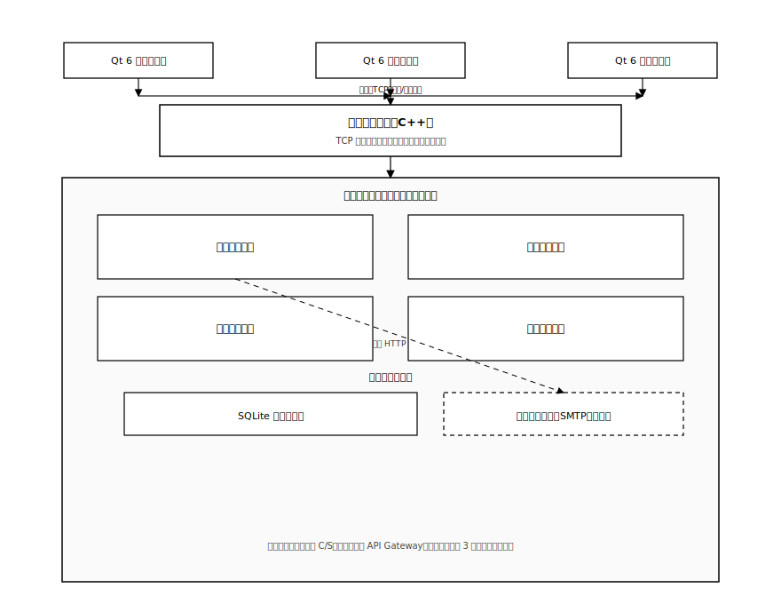

# 第5章 系统实现

本章在**第 4 章**设计与协议约定基础上，按**功能模块**组织实现说明：先给出运行环境与**总体逻辑架构**，再依次阐述**用户管理、好友管理、即时通讯、数据管理**等模块在客户端与服务端的实现要点。各模块小节预留**界面效果图**与**核心代码**插入位置，定稿时可替换为实际截图与源码片段（建议控制篇幅，突出关键路径）。

实现上坚持**聊天主服务端与 Qt 客户端解耦**：服务端采用标准 **C++** 与 **TCP/IP Socket**，不依赖 Qt 网络模块，以便在 **Windows / Linux** 上交叉编译与部署；客户端基于 **Qt 6** 完成界面与长连接通信。邮箱 **SMTP** 发信由可选的**独立辅助服务**承担，主服务端通过**内网 HTTP** 调用。

---

## 5.1 开发与运行环境配置

1. **硬件环境**：开发机需可同时运行聊天服务端、邮件辅助服务（若启用）、多个客户端实例及数据库调试工具（具体 CPU/内存型号可在定稿时按实验室机器填写）。

2. **软件环境**：
   * **操作系统**：Windows 11（主开发与联调）；**Ubuntu 22.04**（服务端跨平台编译与运行验证，可选）。
   * **客户端**：**Qt 6.5.3**（LTS），**Qt Creator**、**CMake**；编译器 **MSVC**（Windows）或 **GCC/Clang**（Linux）。
   * **聊天服务端**：**Visual Studio 2022** 或 **CMake** 工程；**MSVC** / **GCC**；网络层为 **Winsock** / **POSIX Socket**。
   * **数据库**：**SQLite 3**，服务端以单文件库持久化业务数据。
   * **邮件辅助服务（可选）**：如 **Node.js** + **Nodemailer** 等，监听内网端口，提供带鉴权的 **HTTP** 发信接口。
   * **版本管理**：**Git**；协议常量、消息类型枚举等建议以**共享头文件**或文档维护，保证 **C++** 客户端与服务端一致。

---

## 5.2 系统总体架构设计

本系统部署于**局域网**，采用 **C/S** 模式：多台 **Qt 6 桌面客户端**通过 **TCP** 长连接接入**同一聊天主服务端进程**。服务端在进程内按功能划分**用户、好友、即时通讯、文件传输**等逻辑模块，并统一通过 **SQLite** 落库；**注册验证码邮件**等能力通过**可选的邮件辅助进程**完成，与主服务端**进程分离**，降低主程序对 **SMTP/TLS** 的耦合。

下图在风格上借鉴常见“客户端—接入层—内部模块—基础能力”的分层示意图，但**不引入微服务注册中心或独立 API 网关**：图中“聊天主服务端”对应**单进程**内的接入与分发，大矩形框表示**逻辑模块边界**而非物理微服务。

**图 5-1 系统架构图（逻辑分层）**

**架构要点归纳**：

1. **客户端层**：功能相同的 **Qt** 客户端可在多台局域网终端运行，仅通过 **IP/端口** 指向服务端。
2. **接入与分发**：服务端完成 **监听、accept、会话维护、定长帧解析**（参见第 4 章协议），将解析后的业务请求派发到对应逻辑模块。
3. **进程内模块**：与第 3 章需求中的四大功能域对齐，便于分节撰写实现与测试用例。
4. **数据与外部协作**：**SQLite** 为权威存储；**邮件辅助服务**仅被**用户管理**相关逻辑调用（图中以虚线表示 **HTTP** 依赖）。

---

## 5.3 用户管理模块实现

### 5.3.1 界面实现

登录、注册、验证码获取等界面基于 **Qt Widgets** 搭建，采用 **QSS** 统一配色与控件风格。邮箱输入框可配合**正则表达式**做格式校验；验证码按钮可配合**倒计时**防止频繁请求。**（此处可插入：登录界面效果图、注册界面效果图。）**

### 5.3.2 客户端实现要点

客户端使用 **`QTcpSocket`** 与服务器建立长连接，在 `readyRead` 槽函数中读取字节流并交由**与第 4 章一致的帧解析器**组帧。注册、登录、获取验证码等操作封装为不同 **Type** 的请求体（如 **JSON**），经统一头发送。口令处理应与服务端约定一致（优先由服务端做**加盐哈希**存储；客户端避免单独依赖弱摘要算法）。**（此处可插入：`QTcpSocket` 连接、组包发送相关核心代码。）**

### 5.3.3 服务端实现要点

服务端在解析注册/登录类报文后，访问 **`users`、`email_codes`** 等表：生成验证码与过期时间、校验邮箱占用情况、写入口令哈希；登录成功后建立**会话上下文**（如 **token**），并在内存中维护 **`user_id → 套接字/会话对象`** 映射，供后续消息路由使用。断线时应清理映射并触发离线通知。**（此处可插入：会话表维护、登录校验相关核心代码。）**

### 5.3.4 邮件辅助与核心代码说明

主服务端在需要发信时，向**邮件辅助服务**发起 **HTTP** 请求（携带共享密钥），由辅助进程通过 **SMTP** 将验证码送达用户邮箱。主进程不保存邮箱 **SMTP** 授权码，降低泄露风险。**（此处可插入：HTTP 调用封装、验证码生成与校验核心代码。）**

---

## 5.4 好友管理模块实现

### 5.4.1 界面实现

主界面一侧展示**好友列表**（昵称、头像、在线状态），另提供**搜索用户**、**好友申请列表**（待同意/拒绝）等子界面。在线状态可通过图标颜色或灰度区分。**（此处可插入：好友列表、申请列表界面效果图。）**

### 5.4.2 客户端实现要点

客户端将用户输入的检索关键字、申请/处理操作封装为协议报文发送；收到服务端推送的**列表刷新**或**状态变更**信令后，更新本地模型与视图（如 **`QAbstractItemModel`** 或简单容器 + 刷新列表控件）。**（此处可插入：发起申请、处理申请相关槽函数代码。）**

### 5.4.3 服务端实现要点

服务端根据请求查询 **`users`**，在 **`friend_requests`** 中插入或更新申请状态；同意时在 **`friends`** 中建立双向或规范化单向关系（与第 4 章设计一致），并通过长连接向相关用户下发通知帧。**（此处可插入：好友关系 SQL 与推送逻辑核心代码。）**

### 5.4.4 核心代码说明

**（此处可插入：好友模块路由分发、与在线用户表协作的关键代码片段。）**

---

## 5.5 即时通讯模块实现

### 5.5.1 界面实现

聊天窗口采用**气泡式布局**（发送右对齐、接收左对齐），历史消息可由 **`QTextEdit`/`QPlainTextEdit`** 或自定义控件承载；支持表情快捷插入与**文件/图片发送入口**。**（此处可插入：私聊窗口、文件进度条界面效果图。）**

### 5.5.2 文字消息收发与路由实现

发送端将文字内容、对端用户 ID、时间戳等写入 **Body** 并发送。服务端根据接收方 ID 查询**在线映射**：在线则向对端套接字 **send** 转发；离线则 **`INSERT` 入 `messages` 表**并可在对端上线后分页拉取或推送。可选实现 **`is_read`** 或已读回执报文。**（此处可插入：消息路由、离线落库核心代码。）**

### 5.5.3 文件分片传输实现

发送端使用 **`QFile`** 按固定块大小读取文件，为每块附带**文件会话 ID、序号、总片数**等元数据并封帧；可在 **`QThread`** 中读盘与组包，通过信号更新进度条。接收端按序写入临时文件后合并；服务端可转发分片或按设计仅中继元数据。**（此处可插入：分片读写与进度反馈核心代码。）**

### 5.5.4 核心代码说明

**（此处可插入：即时通讯模块报文类型分支、与文件会话状态机关联的代码片段。）**

---

## 5.6 数据管理模块实现

### 5.6.1 界面实现

提供按好友、时间范围筛选的**历史记录浏览**界面，支持**分页加载**（上拉/按钮加载更多）。**（此处可插入：聊天记录查询界面效果图。）**

### 5.6.2 服务端实现要点

基于 **`messages` 表**使用 **`ORDER BY send_time DESC`** 与 **`LIMIT` / `OFFSET`**（或时间游标）实现分页，避免一次加载过多记录。对敏感字段查询同样使用**参数绑定**。**（此处可插入：分页查询 SQL 与结果封装代码。）**

### 5.6.3 客户端实现要点

客户端发起历史拉取请求后，将结果追加到界面模型；若存在本地缓存，应以**服务端返回数据为准**做合并或覆盖，避免显示过期记录。文件传输记录可参考 **`file_transfers` 表**做状态展示或断点续传扩展。**（此处可插入：客户端分页请求与模型更新代码。）**

### 5.6.4 核心代码说明

**（此处可插入：数据管理相关协议处理、与 UI 协作的关键代码片段。）**

---

## 本章小结

本章从**环境、总体架构到四大功能模块**说明了系统实现路径：服务端以 **Socket + SQLite** 为核心，客户端以 **Qt 6** 为载体，邮件能力通过**辅助服务**解耦。后续可在各小节占位处补充**运行截图与精简源码**，并在**第 6 章**对关键功能与性能进行验证。
